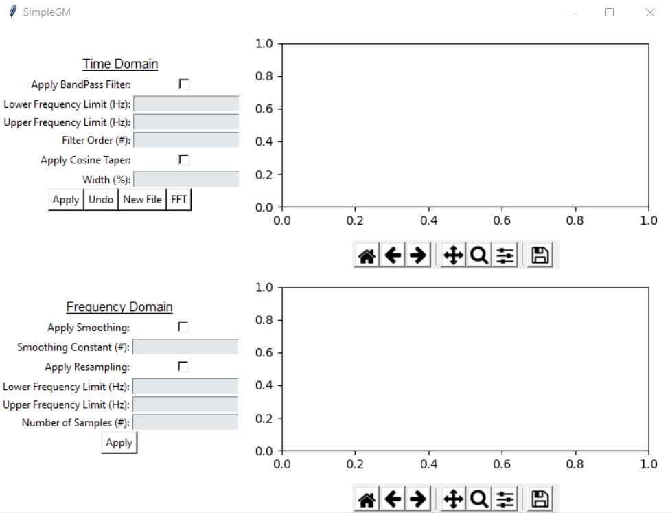
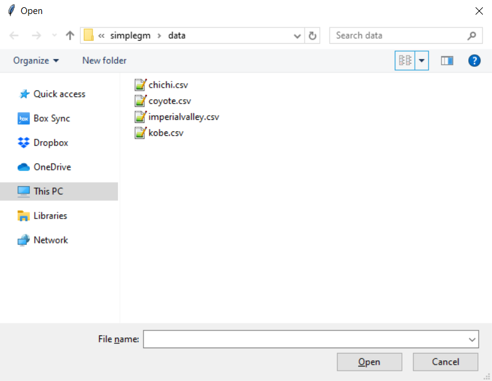
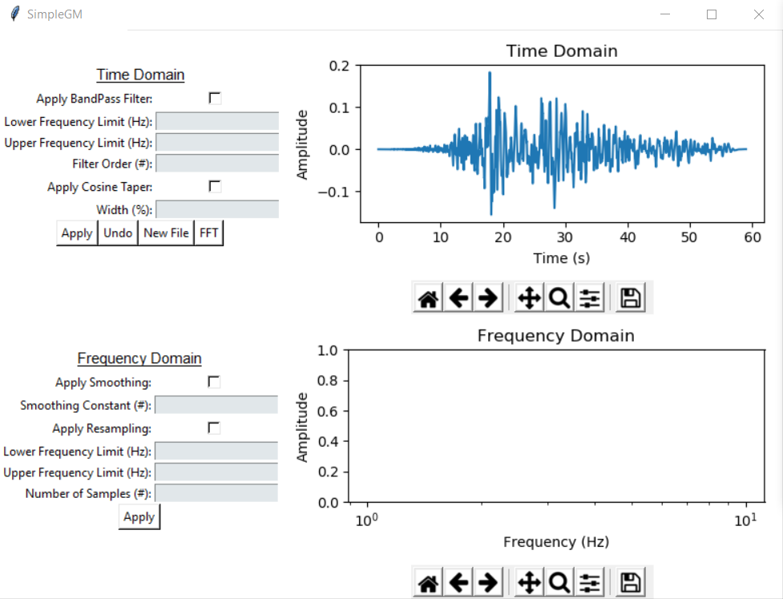
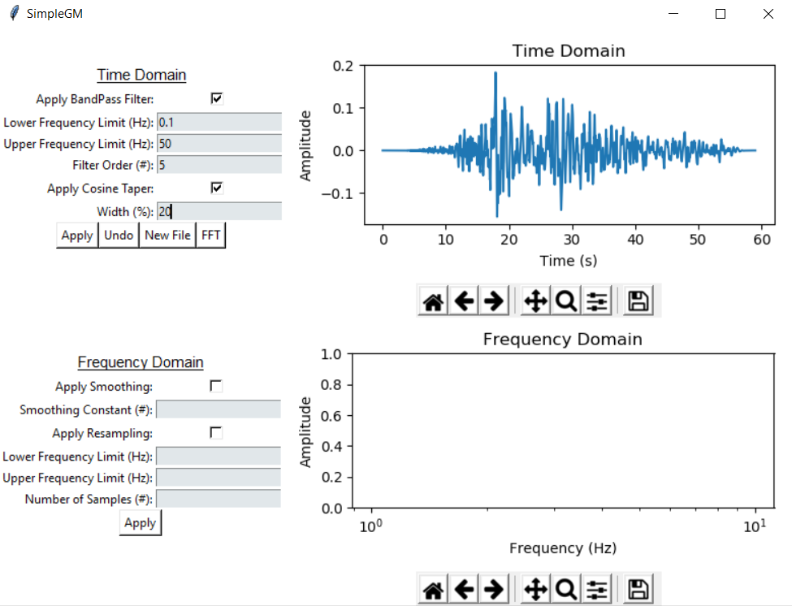
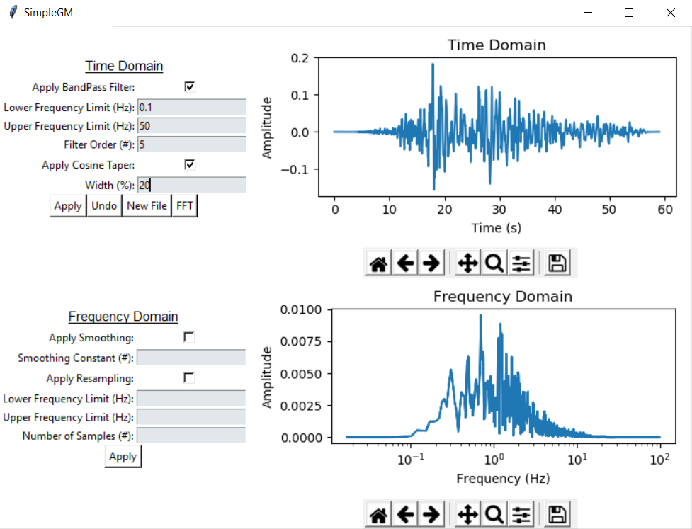
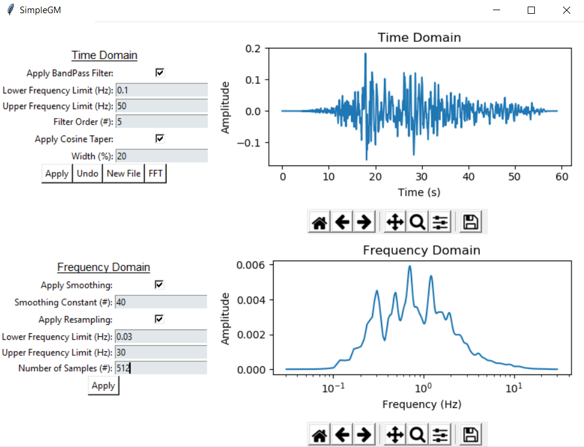

# SimpleGM - A graphical user interface for simple ground motion processing

> Copyright (C) 2019 Joseph P. Vantassel (jvantassel@utexas.edu)

_SimpleGM_ is a graphical user interface for _SigProPy_, an open-source digital
signal processing module for Python. _SimpleGM_ was built as an easy-to-use
interface for performing some of the most common methods of ground motion
processing.

## Getting Started

After downloading and unzipping the repository:

1. Open the command prompt.

2. Navigate to the directory containing the file `simplegm.py`.

3. Enter `python simplegm.py` to launch the program using python.

4. The main and folder navigation window will appear, figures of which are shown
 below.

  
  

 5. Navigate to the folder named `data` included in the repository download. You
 will see four comma-delimited ground-motion record files. These files are shown
 in the example navigation window above.

 6. Select the `chichi.csv` ground-motion record. The main window will update to
 appear below.

  

  7. Apply a butter worth filter and cosine taper by editing the dialog boxes on
  the top left and then pressing `Apply`. To apply a different filter or taper
  to the time record, press `Undo` to return to the original time record,
  enter the new settings, and press `Apply`.

  

  8. Perform the Fast-Fourier Transform on the filtered and tapered record by
  pressing `FFT`.

  

  9. Apply Konno and Ohmachi smoothing and resampling to the Fourier tranform by
  using the dialog boxes on the bottom left and pressing `Apply`. To apply a
  different set of value to the Fourier transform, press `FFT` to
  return to the a clean version of the Fourier transform, enter the new
  settings, and press `Apply`.

  

